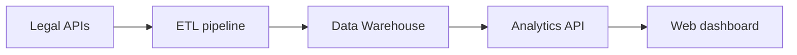

# Documentation

## DatumLex

> Academic legal-data intelligence platform for consolidating and analyzing public decisions, cases, and precedents.

## About the project

DatumLex is the Integrated Project-Based Learning project for the fifth semester of the Database program at Fatec São José dos Campos, term 2026-2, developed in partnership with Xertica.

The system aims to reduce fragmentation in legal information. Legal professionals and researchers currently need to consult different portals, such as DataJud/CNJ and court websites, which use different standards and formats. Results are also generally presented as lists of documents without consolidated quantitative indicators.

## Proposed solution

Build a data pipeline capable of extracting, transforming, and storing public legal data in a dimensional Data Warehouse. The data will be provided through an API and displayed in a single web dashboard with filters and indicators by court, legal topic, and period.

## MVP focus

- Data intelligence and a broad analytical view
- Volume and time-trend indicators
- Comparisons across courts and legal topics
- Dimensional Data Warehouse
- One dashboard for all users
- Individual case search as a secondary feature
- Precedent-adherence rate only after its rule is defined and validated

## Target audience

- Attorneys and legal teams;
- Judges and judiciary professionals;
- Researchers;
- Legal students.

The MVP does not include different dashboards or permission levels by profession.

## Architecture summary



## Documentation structure

```text
datumlex/
├── README.md
├── CONTRIBUTING.md
├── agile/
│   ├── scrum-roles.md
│   ├── requirements-flow.md
│   ├── product-backlog.md
│   └── sprint-planning.md
├── devops/
│   ├── git-flow.md
│   └── quality-and-testing.md
├── architecture/
│   ├── etl-pipeline.md
│   ├── data-warehouse-modeling.md
│   ├── data-dictionary.md
│   ├── api-documentation.md
│   └── privacy-and-lgpd.md
├── design/
│   ├── style-guide.md
│   └── brainstorming.md
└── .github/
    ├── ISSUE_TEMPLATE/
    └── PULL_REQUEST_TEMPLATE.md
```

## Quick access

### Agile management

- [Scrum roles and responsibilities](agile/scrum-roles.md)
- [Requirements flow](agile/requirements-flow.md)
- [Initial Product Backlog](agile/product-backlog.md)
- [Suggested sprint planning](agile/sprint-planning.md)

### Development and quality

- [Team Git Flow](devops/git-flow.md)
- [Quality, testing, and CI/CD](devops/quality-and-testing.md)

### Architecture

- [ETL pipeline](architecture/etl-pipeline.md)
- [Data Warehouse modeling](architecture/data-warehouse-modeling.md)
- [Data dictionary](architecture/data-dictionary.md)
- [Initial API documentation](architecture/api-documentation.md)
- [Privacy and LGPD](architecture/privacy-and-lgpd.md)

### Design

- [Style Guide](design/style-guide.md)
- [Brainstorming and records](design/brainstorming.md)

## Technologies

Python and Django were suggested in the challenge document but still need confirmation by the team. Database, frontend, ETL, testing, and hosting choices must be technically justified throughout the project.

## Current status

**Stage:** Sprint 1 - discovery, organization, and MVP definition.

Before implementation, the team still needs to confirm with the partner:

1. initial court or small group of courts;
2. legal topic for the first scope;
3. historical period;
4. three priority indicators;
5. definition of precedent adherence;
6. final technology stack.

## Notice

This is an academic project and does not provide legal advice. Every indicator must disclose its source, period, update date, coverage, and limitations.
